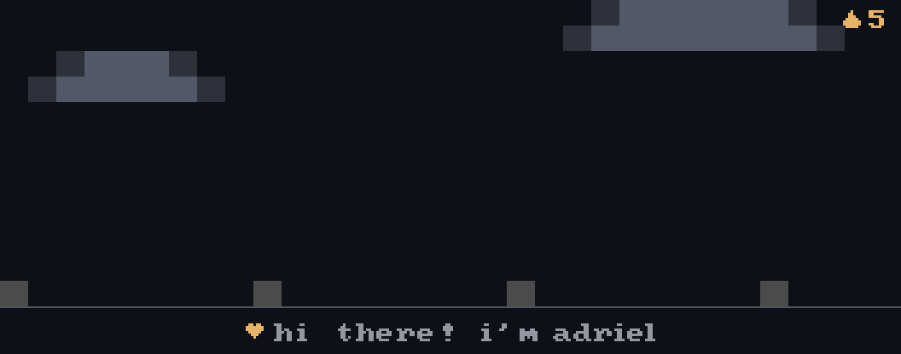

  

<h2> About Me & Journey</h2>

  Mahasiswa Sistem Informasi di <b>Universitas Klabat (UNKLAB)</b> yang berfokus dalam membangun solusi digital modern melalui <b>Integrasi AI</b>, <b>Pengembangan Web & Mobile</b>, serta <b>Software Testing</b> untuk menciptakan pengalaman pengguna yang imersif dan aplikasi berskala tinggi.

- 🎓 **Pendidikan:** Mahasiswa Sistem Informasi, **Universitas Klabat (UNKLAB)** (2023 — 2027)
- 💼 **Saat ini:** Magang di **LLDIKTI Wilayah XVI** untuk pengembangan sistem
- 🏆 **Pencapaian:** Pemenang *Best Technical Excellence Award* (Proxo Coris 2026 — Kategori Mobile App Development)
- 🌱 **Fokus Keahlian:** Integrasi AI pada aplikasi modern, arsitektur perangkat lunak bersih, dan pengujian sistem
- 🎯 **Tujuan Karir:** Menciptakan solusi digital yang berdampak nyata dan memecahkan tantangan teknologi kompleks

<h2> Tools of the Trade</h2>

  

<h2> GitHub Activity</h2>

   
  
  

<h2> Let's Connect</h2>

  

  &nbsp;&nbsp;
  &nbsp;&nbsp;
  &nbsp;&nbsp;
  

build · learn · ship · repeat

