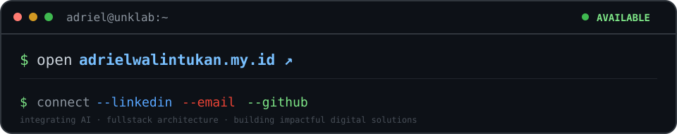

<!-- Cyber-AI Animated Hero Banner -->
<p align="center">
  
</p>

<!-- Live Typing Animation & Status Badges -->
<div align="center">
  <a href="https://github.com/adrielwalintukan">
    
  </a>

  <br/><br/>

  &nbsp;
  &nbsp;
  &nbsp;
  
</div>

<br/>

<!-- About Me Section -->
<h2> &nbsp;Developer Architecture</h2>

```typescript
const adriel: FullstackArchitect = {
  name: "Adriel Walintukan",
  role: "Fullstack Developer & AI Integration Specialist",
  institution: "Universitas Klabat (UNKLAB) [2023 — 2027] 🎓",
  program: "Sistem Informasi",
  internship: "LLDIKTI Wilayah XVI (System Development & Rekayasa Sistem Informasi) 💼",
  award: "Best Technical Excellence Award (Proxo Coris 2026 - Mobile App Development) 🏆",
  portfolio: "https://adrielwalintukan.my.id 🌐",
  focus: "Integrasi Artificial Intelligence (AI) ke dalam sistem web & mobile performa tinggi 🚀",
  specialties: {
    core: ["AI Integration", "Clean Architecture", "Software Testing"],
    frontend: ["React Native", "Next.js", "TypeScript", "Vite", "Tailwind CSS"],
    backend: ["Python", "Node.js", "Laravel", "PostgreSQL", "Supabase", "Convex"],
  },
  motto: "Crafting intelligent, high-impact digital solutions that scale ⚡",
};
```

<h2> &nbsp;Tools of the Trade</h2>

<p align="center">
  
</p>

<h2> &nbsp;GitHub Activity &amp; Telemetry</h2>

<p align="center">
  <br/>
  
  
</p>

<h2> &nbsp;Let's Connect</h2>

<p align="center">
  <a href="https://adrielwalintukan.my.id"></a>
</p>

<p align="center">
  <a href="https://adrielwalintukan.my.id" target="_blank"></a>&nbsp;&nbsp;
  <a href="https://linkedin.com/in/adrielwalintukan" target="_blank"></a>&nbsp;&nbsp;
  <a href="mailto:adrielwalintukan27@gmail.com"></a>&nbsp;&nbsp;
  <a href="https://github.com/adrielwalintukan"></a>
</p>

<p align="center"><sub>integrating AI · fullstack architecture · building impactful digital solutions</sub></p>
